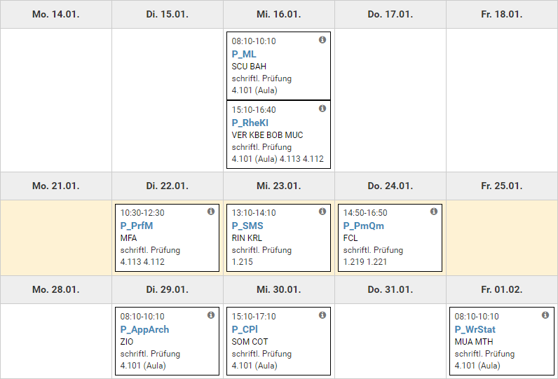

## [Statistical Machine Learning](https://skripte.hsr.ch/Elektrotechnik/Fachbereich/Statistical_Machine_Learning/ML/) (Mi. 16. Januar, 08:10-10:10)

- 2 hours
- open book
- no electronic devices
- no returning to the exam room for any reason

[source](https://skripte.hsr.ch/Elektrotechnik/Fachbereich/Statistical_Machine_Learning/ML/SemesterPlan/StatisticalMachineLearningSemesterPlan.xlsx)

## [Rhetorische Kommunikation für IngenieurInnen](https://moodle.hsr.ch/course/view.php?id=1516) (Mi. 16. Januar, 15:10-16:40)

- keine Unterlagen

<https://moodle.hsr.ch/course/view.php?id=1516&section=15>

## [Programmiersprachen und formale Methoden](https://moodle.hsr.ch/course/view.php?id=1432) (Di. 22. Januar, 10:30-12:30)

- keine Unterlagen
- Englisch

## [System Modeling and Simulation](https://skripte.hsr.ch/Informatik/Fachbereich/System_Modeling_and_Simulation/SMS/) (Mi. 23. Januar, 13:10-14:10)

- mit Vorlesungsunterlagen, explizit keine alten Prüfungen

## [Projekt- und Qualitätsmanagement](https://skripte.hsr.ch/Informatik/Fachbereich/Projekt-_und_Qualitaetsmanagement/PmQm/) (Do. 24. Januar, 14:50-16:50)

- Die schriftliche Prüfung besteht aus Multiple Choice Fragen sowie Fallbeispielen. Die Lehrmittel können verwendet werden. Sie dürfen sämtliche Bücher, Übungen und Vorlesungsfolien für die Lösung der Prüfung benutzen. Die Daten können Sie entweder auf Papier, PC oder Tablet mitbringen. Sie dürfen sämtliche technischen Hilfsmittel nutzen. Das einzige, was Sie nicht dürfen ist: Sie dürfen nur auf Daten zugreifen, welche sich im Prüfungsraum bei ihnen persönlich befinden. Das heisst: Sämtliche Kommunikationsverbindungen müssen offline sein, dies betrifft auch die Bluetooth Verbindungen (oder Hersteller proprietäre Protokolle), z.B. zu Ihrer Maus.

## [Application Architecture](https://skripte.hsr.ch/Informatik/Fachbereich/Application_Architecture/AppArch/2018/) (Di. 29. Januar, 08:10-10:10)

- erlaubte Unterlagen: Open Book inklusive Lösungen zu den Übungsaufgaben
- keine elektronischen Hilfsmittel
- keine alten Prüfungen
- keine Musterlösungen zu den alten Prüfungen

## [C++](https://skripte.hsr.ch/Informatik/Fachbereich/C++/CPl/) (Mi. 30. Januar, 15:10-17:10)

- all paper documents are allowed except:
  - old exams and
  - exercises of old exams

<https://wiki.ifs.hsr.ch/CPlusPlus/files/15_c++_exam_preparation.pdf>

## [Wahrscheinlichkeitsrechnung und Statistik](https://moodle.hsr.ch/course/view.php?id=1483) (Fr. 01. Februar, 08:10-10:10)

- Open Books, es können beliebige gedruckte oder handgeschriebene Hilfsmittel verwendet werden.
- Taschenrechner.
- Notebook-Computer sind nicht zulässig.
